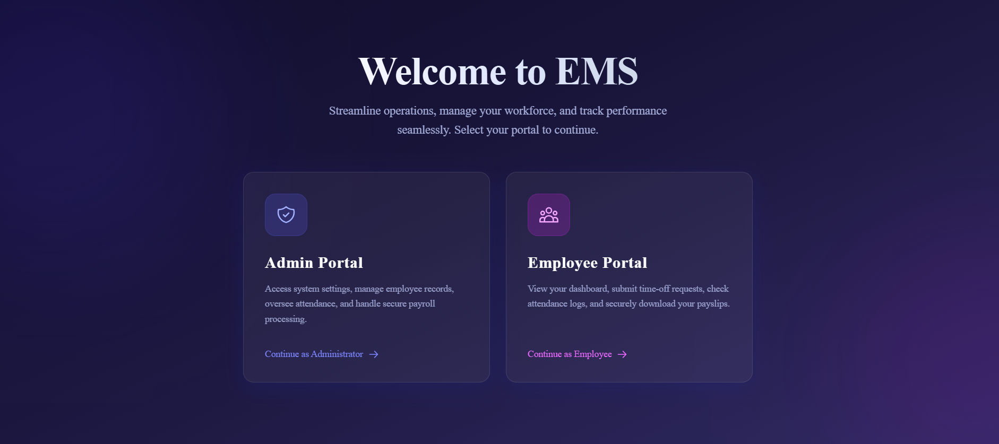
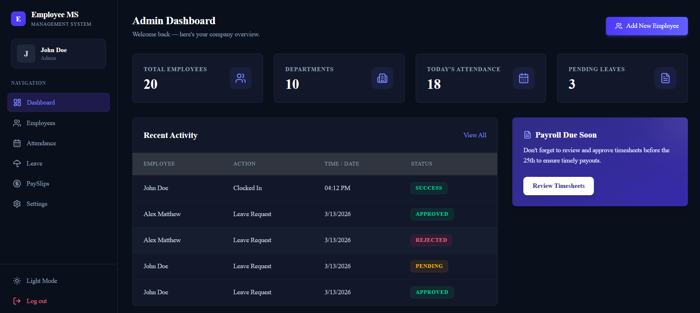
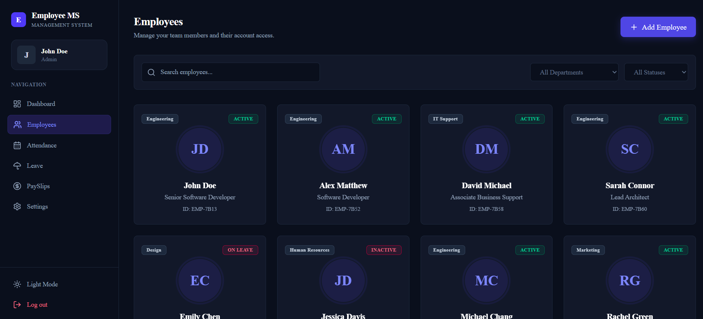
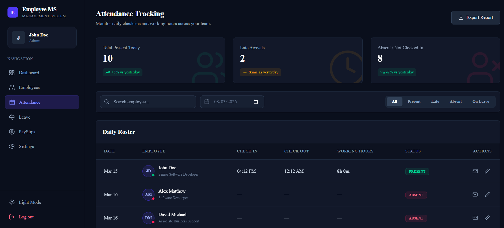
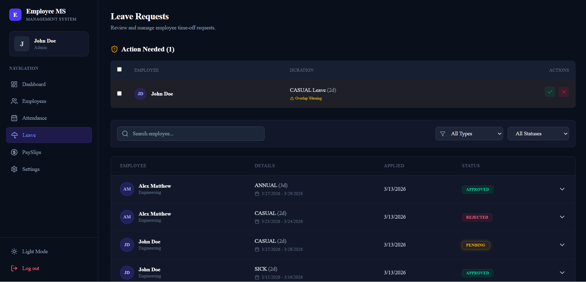
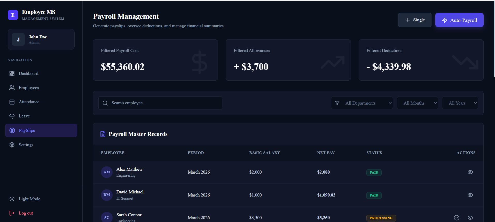
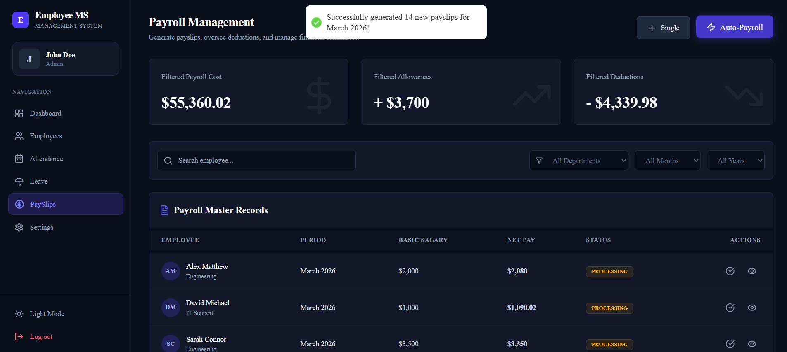
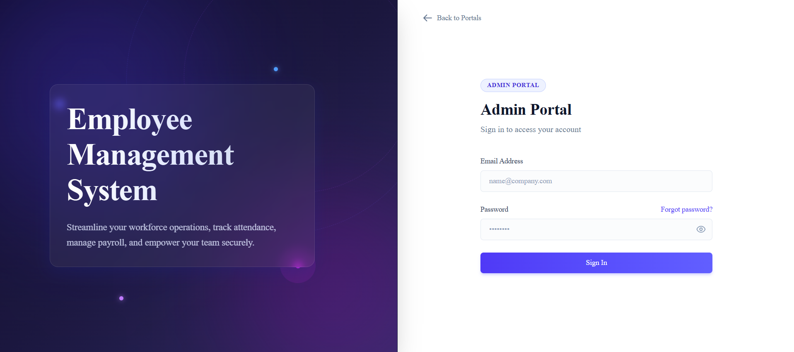

# Employee Management System (EMS) 🏢

A comprehensive, full-stack application built to streamline HR processes, manage employee records, track attendance, and handle payroll seamlessly. 

## 🚀 Features

* **Role-Based Access Control:** Distinct portals and dashboards for HR Admins and regular Employees.
* **Employee Directory:** Easily add, edit, view, or remove employee profiles, contact details, and department assignments.
* **Attendance Tracking:** Automated daily check-in/check-out logging with visual roster and late/absent tracking.
* **Leave Management:** Employees can request time off, and managers can approve, reject, or leave requests pending.
* **Payroll Management:** Generate payslips, oversee deductions, manage allowances, and calculate net pay efficiently.
* **Dark/Light Mode:** Modern UI with customizable themes for better user experience.

## 📸 Demo Screenshots

### 1. Welcome Portal


### 2. Admin Dashboard


### 3. Employee Management


### 4. Attendance Tracking


### 5. Leave Management


### 6. Payroll Management


### 7. Payslips


### 8. Onboarding



## 📁 Project Structure

```text
Employees management system/
│
├── client/                 # Frontend (React + Vite)
│   ├── public/             # Static assets
│   ├── src/
│   │   ├── assets/         # Images, icons, etc.
│   │   ├── components/     # Reusable UI components
│   │   ├── pages/          # Route components (Dashboard, Login, etc.)
│   │   ├── App.jsx         # Main application and routing
│   │   ├── index.css       # Global styles (TailwindCSS)
│   │   └── main.jsx        # React entry point
│   ├── package.json        # Frontend dependencies
│   └── vite.config.js      # Vite configuration
│
├── server/                 # Backend (Node.js + Express) - WIP
│   ├── config/             # DB connection and configurations
│   ├── controllers/        # Request handlers (logic)
│   ├── middleware/         # Custom middlewares (e.g., auth)
│   ├── models/             # Mongoose database schemas
│   ├── routes/             # Express API routes
│   ├── .env                # Environment variables (create this)
│   ├── package.json        # Backend dependencies
│   └── server.js           # Backend entry point
│
├── screenshots/            # Demo images for README
└── README.md               # Project documentation
```

## 💻 Technologies Used

**Frontend:**
* React.js (v19)
* Vite
* TailwindCSS (v4)
* React Router DOM
* Framer Motion (Animations)
* Lucide React & React Icons

**Backend:**
* Node.js
* Express.js (v5)
* MongoDB with Mongoose
* JSON Web Token (JWT) for Authentication
* Bcrypt.js for Password Hashing
* Multer for File Uploads

## 🛠️ Installation & Setup

To run this project locally, follow these steps:

### Prerequisites
* [Node.js](https://nodejs.org/) installed on your machine
* [MongoDB](https://www.mongodb.com/) installed locally or a MongoDB Atlas URI

### 1. Clone the repository
```bash
git clone https://github.com/yourusername/your-repo-name.git
cd "Employees management system"
```

### 2. Backend Setup
```bash
cd server
npm install
```
Create a `.env` file in the `server` directory and add your environment variables:
```env
PORT=5000
MONGODB_URI=your_mongodb_connection_string
JWT_SECRET=your_secret_key
```
Start the backend server:
```bash
npm run dev
```

### 3. Frontend Setup
Open a new terminal window:
```bash
cd client
npm install
```
Start the frontend development server:
```bash
npm run dev
```

## 🤝 Contributing
Contributions, issues, and feature requests are welcome!

## 📝 License
This project is ISC licensed.
